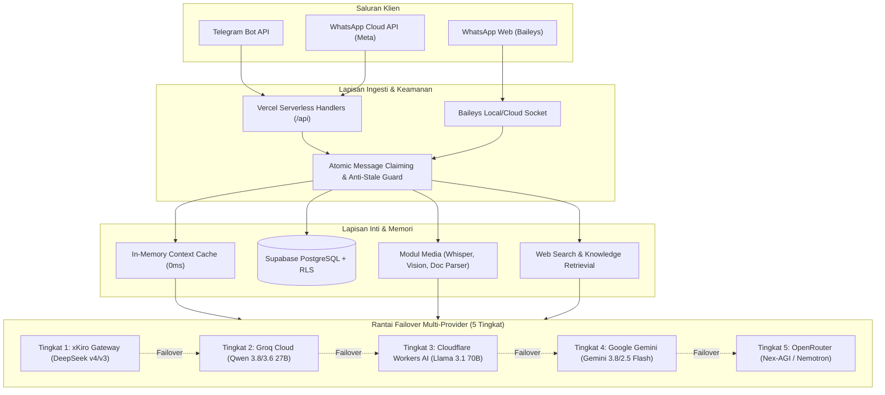

# FreeAIBot / AgentKit

Asisten kecerdasan buatan terpadu, multimodal, dan beroperasi 24/7 pada platform WhatsApp dan Telegram. Dibangun dengan arsitektur TypeScript modern, Vercel Serverless, basis data Supabase PostgreSQL berkeamanan tinggi, dan sistem failover multi-provider 5 tingkat.

[](LICENSE)
[](https://www.typescriptlang.org/)
[](https://nodejs.org/)
[](https://free-chatbot-ai.vercel.app)
[](https://supabase.com)
[](https://t.me/chatkita_bot)
[](https://wa.me/6283874640066)

---

## Ringkasan Eksekutif & Akses Layanan

FreeAIBot mengintegrasikan kemampuan pemrosesan bahasa alami tingkat tinggi dengan otomasi tugas lintas aplikasi perpesanan. Layanan ini dapat diakses secara publik melalui tautan berikut:

| Saluran Akses | Endpoint / Identitas | Keterangan Operasional |
| :--- | :--- | :--- |
| **Telegram Bot** | [@chatkita_bot](https://t.me/chatkita_bot) | Aktif 24/7 via Vercel Serverless Webhook |
| **WhatsApp Bot** | [+62 838-7464-0066](https://wa.me/6283874640066) | Dukungan ganda: WhatsApp Cloud API & Baileys Multi-Device |
| **Landing Page Publik** | [free-chatbot-ai.vercel.app](https://free-chatbot-ai.vercel.app) | Beranda informasi produk & panduan penggunaan |
| **Observability Console** | [free-chatbot-ai.vercel.app/dashboard](https://free-chatbot-ai.vercel.app/dashboard) | Monitoring kuota upstream, kesehatan API key, & ekspor dataset |

---

## Arsitektur Sistem

Sistem menggunakan prinsip *Single Unified Brain, Multi-Channel Execution* dengan pemisahan lapisan komputasi, persistensi data, dan perutean model AI:



---

## Fitur & Keunggulan Utama

### 1. Kemampuan Multimodal Menyeluruh
- **Voice Note & Audio**: Transkripsi suara otomatis menggunakan Groq Whisper API v3 berkecepatan tinggi, mengubah pesan suara menjadi teks instan.
- **Analisis Dokumen**: Ekstraksi dan pembedahan berkas PDF, Word (.docx), TXT, CSV, JSON, serta cuplikan kode sumber pemrograman.
- **Vision & Citra**: Analisis gambar resolusi tinggi menggunakan Google Gemini Vision Engine untuk membaca foto struk, diagram teknis, tulisan tangan, maupun tangkapan layar.
- **Stiker & Video**: Pemahaman konteks stiker animasi/statis dan transkripsi video pendek secara otomatis.
- **Penelusuran Web Real-Time**: Pencarian informasi aktual di internet via DuckDuckGo dengan filter keamanan SSRF (*Server-Side Request Forgery*) dan pembersih injeksi prompt.

### 2. Rantai Failover Multi-Provider 5 Tingkat
Sistem tidak bergantung pada satu penyedia AI. Jika terjadi pembatasan kuota (*rate limit 429*), gangguan koneksi, atau habisnya saldo, permintaan dialihkan secara instan ke lapisan cadangan berikutnya:

| Prioritas | Provider Gateway | Model Utama | Model Cadangan | Kapasitas Kuota Harian |
| :---: | :--- | :--- | :--- | :--- |
| **1** | **xKiro API** | `deepseek/deepseek-v4-flash` | `deepseek/deepseek-v4-pro`, `deepseek/deepseek-v3.2` | 15.000.000 Token (Pool 3 Key) |
| **2** | **Groq Cloud** | `qwen/qwen3.8-27b` | `qwen/qwen3.6-27b` | 1.000.000 Token (Pool 5 Key) |
| **3** | **Cloudflare Workers AI** | `@cf/meta/llama-3.1-70b-instruct` | `@cf/qwen/qwen2.5-coder-32b-instruct` | 360 Requests (Pool 3 Akun) |
| **4** | **Google Gemini** | `gemini-3.8-flash` | `gemini-2.5-flash` | 1.500 RPD / 1 Juta TPM |
| **5** | **OpenRouter** | `nex-agi/nex-n2.5-pro:free` | `nvidia/nemotron-3.5-lightning:free` | Cadangan Darurat Tanpa Batas |

### 3. Ketahanan Konkurensi & Integritas Pesan
- **Atomic Message Claiming (`claimIncomingMessage`)**: Pola *insert-first* berbasis unique constraint PostgreSQL untuk mencegah duplikasi pemrosesan pesan simultan (*zero TOCTOU*).
- **Anti-Stale Message Guard**: Validasi stempel waktu (`timestamp`) yang mengabaikan pesan tertunda atau hasil pengulangan (*retry storm*) dari webhook Meta/Telegram yang berumur lebih dari 180 detik.
- **Smart Chunking Markdown (`splitMessageSmart`)**: Pemecahan pesan panjang (> 4.000 karakter) yang sadar blok kode (*code-fence aware*), mencegah formatting markdown rusak saat terkirim ke klien perpesanan.

### 4. Tata Kelola Memori & Konteks Persisten
- **Two-Tier Context Window**: Cache memori aktif bergulir (15 interaksi terakhir, TTL 25 detik) untuk responsivitas sub-milidetik, dipadukan dengan persistensi jangka panjang di Supabase.
- **Dynamic Timezone Engine**: Pengenalan zona waktu dinamis pengguna (WIB, WITA, WIT, dan zona internasional) melalui deteksi prefiks nomor telepon atau penerimaan pin lokasi GPS.
- **Sistem Pengingat Mandiri (`remind`)**: Eksekusi pengingat terjadwal via Vercel Cron dengan proteksi sewa atomik (*lease-lock*) dan deadlock reaper.

### 5. Konsol Observabilitas & Dataset Fine-Tuning
- **Monitoring Upstream Real-Time**: Antarmuka dashboard modern dengan visualisasi status kesehatan 12 API key, konsumsi token riil, dan matriks pemakaian model.
- **Keamanan Konsol Kriptografis**: Proteksi Master PIN (SHA-256 + salt statis), penguncian progresif (*anti-brute force*), dan pemulihan PIN via Resend Email OTP.
- **Dataset Evaluasi**: Pengumpulan otomatis pasangan instruksi-respons (*prompt-completion pair*) yang dapat diekspor langsung ke format JSONL (standar fine-tuning OpenAI/ShareGPT) dan CSV.

---

## Daftar Perintah Obrolan

| Perintah / Aksi | Fungsi & Deskripsi |
| :--- | :--- |
| `/reset` atau `reset sesi` | Membersihkan memori aktif pengguna dan mengembalikan konteks ke baseline awal. |
| `/salah <catatan koreksi>` | Menyimpan koreksi, preferensi gaya komunikasi, atau identitas ke basis data permanen. |
| `/remind <menit> <pesan>` | Menjadwalkan pengingat otomatis yang akan dikirimkan oleh bot setelah jeda waktu tertentu. |
| *Kirim Dokumen (PDF/DOCX)* | Membaca isi berkas, mengekstrak intisari, menganalisis data tabel, atau meninjau kode. |
| *Kirim Gambar / Foto* | Menjelaskan isi foto, membaca teks dokumen fisik (OCR), atau mengidentifikasi objek. |
| *Kirim Pesan Suara (VN)* | Mentranskripsi suara ke teks dan langsung menjawab pesan suara tersebut. |
| *Kirim Pin Lokasi GPS* | Menyesuaikan zona waktu lokal dan kota domisili pengguna secara otomatis. |

---

## Struktur Repositori

```text
.
├── api/                        # Serverless Functions (Vercel)
│   ├── admin-otp.ts            # Handler otentikasi PIN & reset OTP email
│   ├── cron/reminders.ts       # Cron worker pengecekan pengingat terjadwal
│   ├── dataset.ts              # Endpoint ekspor dataset JSONL / CSV
│   ├── stats.ts                # Endpoint telemetri & monitoring kuota upstream
│   ├── webhook.ts              # Webhook endpoint Telegram Bot API
│   └── whatsapp.ts             # Webhook endpoint Meta WhatsApp Cloud API
├── public/                     # Aset Web Frontend Statis
│   ├── css/                    # Desain sistem & stylesheet antarmuka
│   ├── js/                     # Skrip modular dashboard & event handlers (CSP-compliant)
│   ├── dashboard.html          # Panel observabilitas & konsol telemetri
│   └── index.html              # Landing page publik interaktif
├── sql/                        # Berkas Migrasi Skema Basis Data PostgreSQL
│   ├── schema_migrations.sql   # Ledger riwayat versi skema database
│   └── migrate_v10_*.sql       # Skrip tabel, indeks, RPC, dan kebijakan RLS
├── src/                        # Modul Logika Inti Aplikasi (TypeScript)
│   ├── db.ts                   # Klien Supabase, deduplikasi atomik, & persistensi
│   ├── env.ts                  # Sentralisasi konfigurasi variabel lingkungan
│   ├── logger.ts               # Structured logging JSON terstandarisasi
│   ├── media.ts                # Handler transkripsi Whisper, dokumen, & stiker
│   ├── memory.ts               # Cache memori aktif & pengelola konteks obrolan
│   ├── providers.ts            # Engine inferensi LLM 5-tier multi-gateway
│   ├── remind.ts               # Logika penjadwalan & pengiriman pengingat
│   ├── skills.ts               # Routing autoReply & analisa visual multimodal
│   ├── telegram.ts             # Polling engine & webhook parser Telegram
│   ├── timezone.ts             # Resolusi zona waktu dinamis & geolokasi
│   ├── web.ts                  # SSRF-shielded web search & text scraper
│   ├── whatsapp_baileys.ts     # Klien WhatsApp Web Multi-Device (Baileys)
│   ├── whatsapp_cloud.ts       # Klien Meta WhatsApp Cloud API resmi
│   └── whatsapp_session.ts     # Sinkronisasi sesi login Baileys ke Supabase
├── AGENTS.md                   # Dokumen spesifikasi tata kelola sistem agen & model
├── DOCUMENTATION.md            # Dokumentasi teknis komprehensif & riwayat versi
├── package.json                # Metadata proyek & dependensi Node.js
├── tsconfig.json               # Konfigurasi kompilasi TypeScript
└── vercel.json                 # Konfigurasi deployment, CSP headers, & Vercel Cron
```

---

## Panduan Instalasi & Pengembangan Lokal

### 1. Klon Repositori & Instalasi Dependensi
Pastikan lingkungan Anda telah terpasang **Node.js v20.x atau v22.x** dan **npm**:

```bash
git clone https://github.com/Raflyf/chat-bot.git
cd chat-bot
npm install
```

### 2. Konfigurasi Variabel Lingkungan
Salin template konfigurasi `.env.example` ke `.env` lalu lengkapi kredensial:

```bash
cp .env.example .env
```

Parameter konfigurasi esensial meliputi:
- `TELEGRAM_BOT_TOKEN`: Token otentikasi bot dari BotFather.
- `SUPABASE_URL` & `SUPABASE_KEY`: Kredensial basis data Supabase (disarankan `service_role` key).
- `XKIRO_KEYS`, `GROQ_KEYS`, `CLOUDFLARE_KEYS`: Daftar kunci API upstream (dipisahkan koma).
- `WHATSAPP_TOKEN` & `WHATSAPP_PHONE_NUMBER_ID`: Kredensial Meta WhatsApp Cloud API (opsional jika menggunakan Baileys).
- `ADMIN_PIN`: Master PIN untuk membuka panel monitoring (default: `080402`).

### 3. Validasi Sintaksis & Tipe
Pastikan tidak ada kesalahan kompilasi TypeScript:

```bash
npm run typecheck
```

### 4. Menjalankan Bot di Lingkungan Lokal
Pilih saluran yang ingin dijalankan:

- **Mode Pengembang Telegram (Polling Lokal):**
  ```bash
  npm run dev
  ```
- **Mode WhatsApp Web (Baileys Multi-Device - Pindai QR di Terminal):**
  ```bash
  npm run whatsapp
  ```
- **Kompilasi Bundle Produksi:**
  ```bash
  npm run build
  ```

---

## Panduan Penerapan Produksi (Deployment)

### A. Vercel Serverless (Telegram & Dashboard 24/7)
1. Hubungkan repositori GitHub ini ke akun **Vercel**.
2. Masukkan seluruh variabel lingkungan dari berkas `.env` ke dashboard Vercel (**Settings -> Environment Variables**).
3. Lakukan deployment.
4. Daftarkan webhook Telegram satu kali melalui peramban:
   ```text
   https://api.telegram.org/bot<TELEGRAM_BOT_TOKEN>/setWebhook?url=https://<DOMAIN_VERCEL>/api/webhook&secret_token=<TELEGRAM_WEBHOOK_SECRET>
   ```

### B. Basis Data Supabase
1. Buka dashboard proyek Supabase Anda -> menu **SQL Editor**.
2. Jalankan berkas skrip migrasi secara berurutan dari direktori [sql/](file:///d:/code/project/projek_no_name/sql/) untuk mengaktifkan tabel percakapan, sesi WhatsApp, ledger migrasi, dan kebijakan Row-Level Security (RLS).

### C. WhatsApp Multi-Device 24/7 Mandiri (Cloud Container)
Untuk mengoperasikan WhatsApp tanpa perlu laptop menyala:
1. Pasang aplikasi ini pada penyedia container cloud gratis atau VPS (seperti Render.com, Koyeb, Railway, atau Fly.io).
2. Tentukan perintah start: `npm run whatsapp`.
3. Pindai QR Code satu kali melalui log container terminal.
4. Modul [src/whatsapp_session.ts](file:///d:/code/project/projek_no_name/src/whatsapp_session.ts) akan secara otomatis menyinkronkan berkas sesi otentikasi ke Supabase. Jika container melakukan restart berkala, bot akan langsung login otomatis tanpa perlu memindai ulang.

---

## Spesifikasi Teknis Lanjutan

Untuk informasi arsitektur mendalam, tata kelola failover, protokol audit keamanan, dan kronologi pembaruan versi:
- **[DOCUMENTATION.md](file:///d:/code/project/projek_no_name/DOCUMENTATION.md)**: Riwayat rilis sistem komprehensif (v0.1.0 hingga v0.26.33), arsitektur keamanan, dan manual teknis.
- **[AGENTS.md](file:///d:/code/project/projek_no_name/AGENTS.md)**: Batasan sistem multi-model, dedup atomik, dan tata kelola alur agen.

---

## Lisensi & Hak Cipta

Proyek ini didistribusikan secara terbuka di bawah lisensi resmi [MIT License](LICENSE).  
Hak Cipta (c) 2026 **Rafly Firmansyah**.
